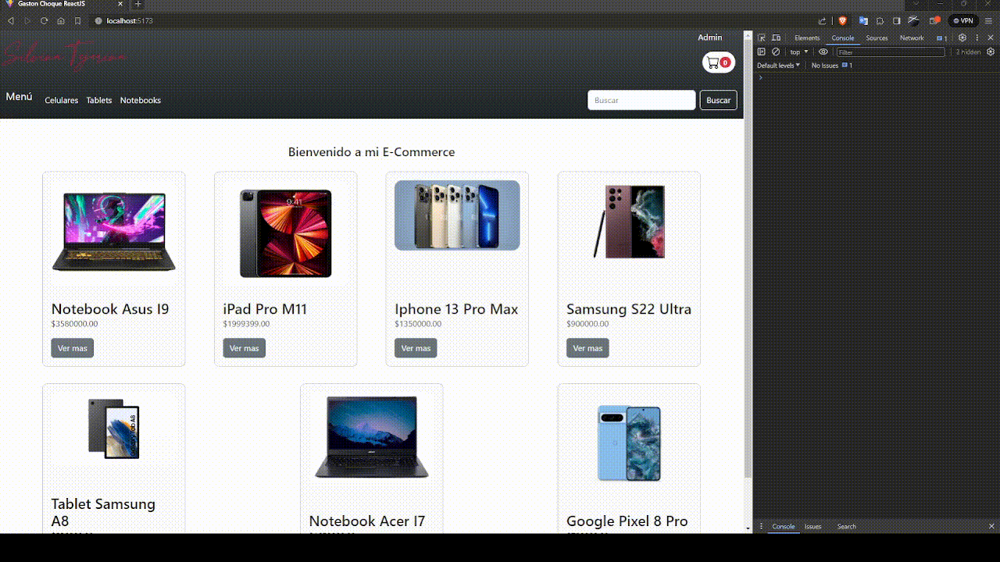

# Proyecto ecommerce "Silvina Tejerina"


## _ReactJs comision 49900_

"Silvina Tejerina" es un proyecto de ecommerce desarrollado con React.js, Vite, Firebase y Bootstrap. Permite a los usuarios ver y comprar productos de diferentes categorías, agregarlos al carrito, modificar cantidades, ver los productos en el carrito y luego realizar el pedido llenando los datos del comprador desde un formularios.


## Caracteristicas y uso

- Inicio
```
"./"
```
 Se listaran todos los articulos disponibles. (Se traera de la base de datos, dotos los articulos disponibles en ella).
 
- Categorias
```
"./category/:categoryId"
```
 Se filtraran los articulos de acuerdo a la categoria elegida en el navbar. (Este filtro se logra mediante los parametros proporcionados por la url para traer de la base de datos todos aquellos alticulos en los cuales su categoria concuerde).
 
- Detalle de producto
```
"/detail/:productId"
```
 Al seleccionar un producto, se desplegara un nuev componente, donde podras ver todas las caracteristicas del mismo, de alli tambien podras agregar el producto al carrito, y modificar la cantidad solicitada (Esta no puede ser mayor al stock del producto cargado en la base de datos), si sales del producto y vuelves a entrar al mismo, el valor inicial del producto, sera el que tengas cargado en el carrito, y no "1" como seria su valor por defecto, en caso de que el producto no cuente con stock, el producto msotrara "0" y un cartel de "Sin stock". (Se filtra el producto por su "id", este es obtenido de los parametros proporcionados por la url y traera de la base de datos el articulo que concuerde con el mismo y aquellos datos extras como por ej "stock" para hacer verificaciones y que la app funcione en perfecto estado, todos los productos agregados al carrito se guardan en el estado "cart" el cual esta anidado en un context para que todos los componentes puedan acceder a el).
 
- Carrito
```
"/cart"
```
 En este componente podras ver todos los productos que añadiste a tu carrito, desde el mismo tambien podras vaciarlo o finalizar la compra. (Esto se hace mediante el estado "cart" ya mencionado)
 
 - Checkout
```
"/checkout"
```
 Al intentar finalizar la compra desde el componente "cart" seras redireccionado a este componente, en donde encontraras un formulario, el cual debes llenar para que tu orden de compra se realice, si los datos fueron cargados correctamente, tu compra resultara exitosa devolvientote el id. (El componente enviara tus datos y los de tu carrito a la base de datos y te devolvera el "id" de tu orden, como extra, tambien vaciara tu carrito automaticamente).
 
 - Admin (En desarrollo)
```
"/admin"
```
> Esta seccion esta en desarrollo, por el momento tiene un boton "Actualizar stock" para que en caso de que la base de datos se quede sin stock por pruebas puedas actualizar el stock con el stock cargado en el archivo "asyncMock", tambien podras cargar mas productos a tu base de datos añadiendolos en este mismo archivo. (Esta caracteristica es solo a modo de facilitar la actualizacion de stock en entornos de pruebas).
Se prevee que desde esta seccion que mediante el login de ciertos usuarios autorizados, se puedan cargar o modificar productos en su totalidad.


## Instalacion

Este proyecto requiere bootstrap, firebase, react, react-dom, react-router-dom, react-toastify, pero estas ya estan cargadas en el archivo "package.json".
Tu propia base de datos, en el paso 3 te explico el formato y donde crearla.

- 1 Clonar el proyecto (La branch por default es "Entrega final")
```
git clone https://github.com/AGastonChoque/GastonChoqueReactJS49900.git
```

- 2 Instalar las depencias mediante el npm
```
npm install
```

- 3 Importar tu propia base de datos
 Crear el archivo ".env" al mismo nivel de directorio que el archivo "package.json" y proporcionar tus credenciales, aqui te dejo un ejemplo del formato que deberia tener este archivo.
```
VITE_apiKey=apiKey
VITE_authDomain=authDomain
VITE_projectId=projectId
VITE_storageBucket=storageBucket
VITE_messagingSenderId=messagingSenderId
VITE_appId=appId
```

- 4 Base de Datos
Para que el proyecto funcione correctamente sin modificar nada de codigo tendras que crear tu base de datos en firestore con la siguiente datos 

```
collection "products": Por cada doc =>

category (string)
description (string)
name (string)
pictureUrl (string)
price (número)
stock (número)
```

```
collection "categories": Por cada doc =>

name (string)
order (número)
slug (string)
```

- 5 Clonar el proyecto (La branch por default es "Entrega final")
```
npm run dev
```


## Test App

[Vercel deploy]


## Gif



[Vercel deploy]: <https://gaston-choque-react-js-49900.vercel.app>

